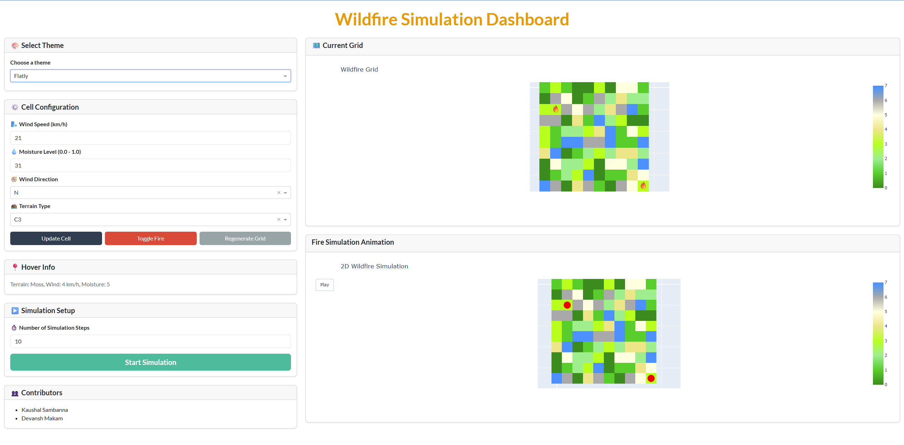
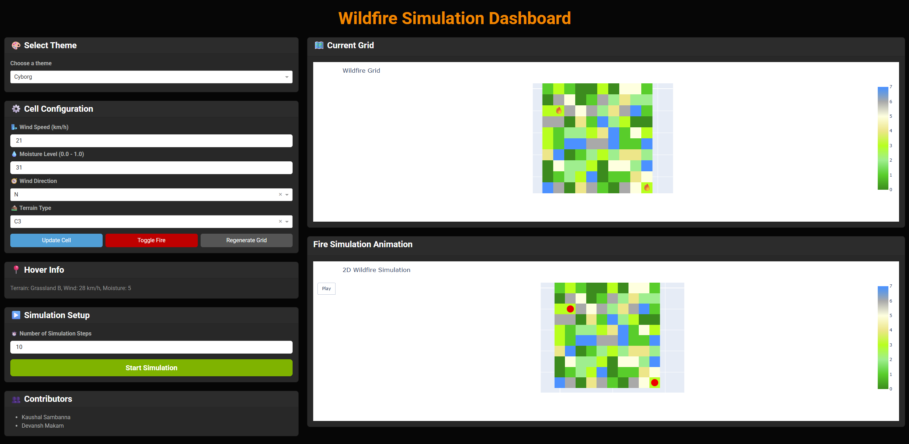

# 🔥 Wildfire Spread Analysis Dashboard

An interactive wildfire simulation dashboard built using [Plotly Dash](https://dash.plotly.com/) and [Dash Bootstrap Components](https://dash-bootstrap-components.opensource.faculty.ai/). This web-based app enables users to simulate and visualize wildfire spread dynamics over a 10x10 grid-based terrain with customizable cell properties, fire behavior controls, and real-time animation.

This dashboard is live on: https://wildfire-spread-analysis.onrender.com/
---

## 🚀 Features

- 🌲 **Interactive Terrain Configuration**  
  Customize each grid cell with terrain type, wind direction, moisture levels, and ignition state.

- 🔄 **Fire Spread Simulation**  
  Animated step-by-step simulation showing how fire spreads based on wind, terrain, and moisture.

- 🧠 **Smart Control Panel**  
  Selecting a cell auto-fills the control panel for real-time property editing.

- 🌗 **Light/Dark Theme Toggle**  
  Switch between light and dark mode for comfortable viewing.

- ⏱️ **Adjustable Animation Speed**  
  Control the pace of the fire spread simulation.

- ✅ **Responsive UI**  
  Optimized layout for desktop and tablets using Bootstrap.

---

## 📸 Screenshots

<p align="center">
  
  <br/>
  
</p>

---

## 🧩 Tech Stack

| Tool | Purpose |
|------|---------|
| [Dash](https://dash.plotly.com/) | Frontend framework |
| [Plotly](https://plotly.com/python/) | Grid visualization |
| [Flask](https://flask.palletsprojects.com/) | Backend server |
| [Dash Bootstrap Components](https://dash-bootstrap-components.opensource.faculty.ai/) | UI Styling |
| [Pandas](https://pandas.pydata.org/) | Grid and state management |

---

## ⚙️ Installation

> 📌 **Python 3.8–3.11 recommended. Python 3.13 is not fully supported by all packages.**

### 🐍 1. Clone and create virtual environment

```bash
git clone https://github.com/Intell-Alpha/wildfire-spread-analysis.git
cd wildfire-spread-analysis

python -m venv venv
source venv/bin/activate    # On Windows: venv\Scripts\activate
```
### 📦 2. Install dependencies
```bash
pip install -r requirements.txt
```
### ▶️ Running the App Locally
```bash
python wildfireTerrainAnimationSteps.py
```
The app will be available at ```http://127.0.0.1:8050```.

### 🌐 Deployment (Render / Gunicorn)
1. Make sure the following line exists in ```wildfireTerrainAnimationSteps.py```:
```bash
server = app.server
```  
2. Use this Render start command:
```bash
gunicorn wildfireTerrainAnimationSteps:server
```  
---

## 🧪 Testing Tips

1. Click a cell to populate control panel fields (wind, terrain, moisture, direction).
2. Modify properties and click **Update Cell** or **Toggle Fire** to observe changes.
3. Start simulation and adjust steps to verify spread behavior.
4. Switch themes and confirm immediate style updates.

---

## ✨ Future Work

- 🔍 **Heatmap Intensity**: Show fire intensity gradient.
- ⛰️ **Elevation Modeling**: Incorporate terrain elevation.
- 📈 **Data Export**: Export simulation frames or CSV logs.
- 🧠 **ML Prediction**: Integrate machine-learning models for predictive spread analysis.

---

## 🤝 Contributing

1. Fork the repository.  
2. Create your feature branch: `git checkout -b feature/YourFeature`  
3. Commit your changes: `git commit -m 'Add some feature'`  
4. Push to the branch: `git push origin feature/YourFeature`  
5. Open a Pull Request.

---

## 📄 License

This project is licensed under the [MIT License](LICENSE).

---

## 🙌 Acknowledgments

- Built with [Dash](https://dash.plotly.com/) & [Plotly](https://plotly.com/)  
- UI styled via [Dash Bootstrap Components](https://dash-bootstrap-components.opensource.faculty.ai/)  
- Inspiration from real-world wildfire modeling research

---

## Contributors

1) Kaushal Sambanna
2) Devansh Makam


